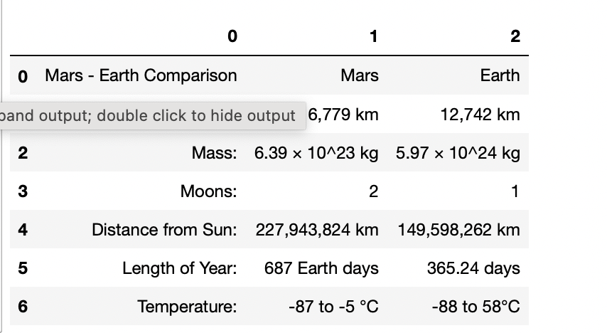

# Web Scraping Challenge

### NASA Mars News

* Scrape the [Mars News Site](https://redplanetscience.com/) and collect the latest News Title and Paragraph Text. Assign the text to variables that you can reference later.

```python
# Result:
news_title = "Sensors on Mars 2020 Spacecraft Answer Long-Distance Call From Earth"

news_p = "Instruments tailored to collect data during the descent of NASA's next rover through the Red Planet's atmosphere have been checked in flight."
```

### JPL Mars Space Images - Featured Image

* Visit the url for the Featured Space Image site [here](https://spaceimages-mars.com).

* Use splinter to navigate the site and find the image url for the current Featured Mars Image and assign the url string to a variable called `featured_image_url`.

* Make sure to find the image url to the full size `.jpg` image.

* Make sure to save a complete url string for this image.

```python
# Result:
featured_image_url = 'https://spaceimages-mars.com/image/featured/mars2.jpg'
```

### Mars Facts

* Visit the Mars Facts webpage [here](https://galaxyfacts-mars.com) and use Pandas to scrape the table containing facts about the planet including Diameter, Mass, etc.

    

### Mars Hemispheres


```python
# Cerberus Hemisphere Enhanced Result:
featured_image_url = 'https://marshemispheres.com/images/f5e372a36edfa389625da6d0cc25d905_cerberus_enhanced.tif_full.jpg'
```

```python
# Schiaparelli Hemisphere Enhanced Result:
featured_image_url = 'https://marshemispheres.com/images/3778f7b43bbbc89d6e3cfabb3613ba93_schiaparelli_enhanced.tif_full.jpg'
```

```python
# Syrtis Major Hemisphere Enhanced Result:
featured_image_url = 'https://marshemispheres.com/images/555e6403a6ddd7ba16ddb0e471cadcf7_syrtis_major_enhanced.tif_full.jpg'
```

```python
# Valles Marineris Hemisphere Enhanced Result:
featured_image_url = 'https://marshemispheres.com/images/b3c7c6c9138f57b4756be9b9c43e3a48_valles_marineris_enhanced.tif_full.jpg'
```